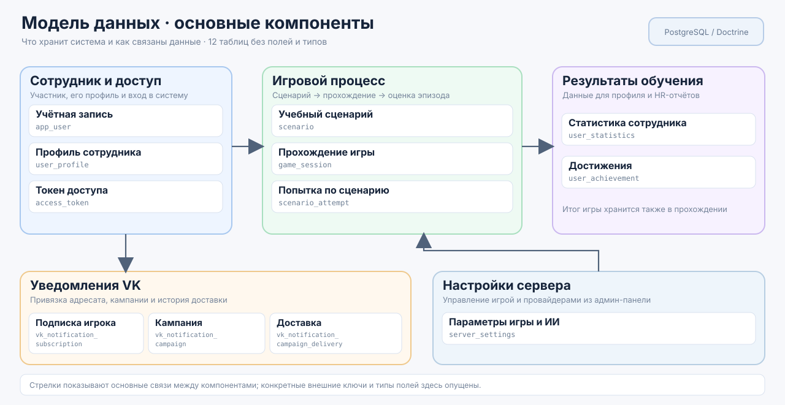

[English](README.md) | **Русский**

# Александр Пономарев

### Backend-разработчик · PHP / Symfony

Я backend-разработчик с **6+ годами коммерческого опыта**, основной стек — PHP и Symfony.

Разрабатываю backend-сервисы, REST API и интеграции, в том числе системы с ИИ, платёжные интеграции, сервисы с интенсивной работой с данными и асинхронной обработкой. В работе уделяю особое внимание понятным границам ответственности, поддерживаемому коду, предсказуемому поведению и прагматичной архитектуре.

## Основной стек

- **Backend:** PHP 8+, Symfony, Laravel
- **Базы данных:** PostgreSQL, MySQL, Redis
- **Очереди и сообщения:** Kafka, RabbitMQ
- **Интеграции:** REST API, платёжные системы, ИИ- и речевые сервисы
- **Качество:** PHPUnit, PHPStan, автоматизированное тестирование
- **Инфраструктура:** Docker, CI/CD
- **Дополнительный опыт:** Go, Java / Spring

## С чем я работаю

- Backend-сервисы и REST API
- Декомпозиция и реализация бизнес-логики
- Интеграции с внешними сервисами, платёжными системами и ИИ
- Проектирование БД и оптимизация запросов
- Асинхронная и событийная обработка
- Рефакторинг legacy-кода
- Оптимизация производительности
- Автоматизированное тестирование и качество кода

---

## Основные проекты

### Transport Education Platform — backend обучающей платформы с ИИ

**Командный проект для хакатона** — интерактивный обучающий тренажёр для сотрудников. Я отвечал за **архитектуру backend и разработку серверной части**; репозиторий ниже содержит серверную часть, над которой я работал.

Платформа запускает нелинейные учебные сценарии, в которых игрок взаимодействует с виртуальными пассажирами и может отвечать текстом, действием или голосом. Backend управляет полным игровым циклом, диалогами с ИИ, оценкой, результатами и интеграцией с игровым клиентом.

**Основные части backend:**

- Игровые сессии, попытки по сценариям и сохранение истории диалога
- Несколько режимов ИИ: Yandex Responses, Codex и OpenAI Realtime
- Обработка голоса и речи с поддержкой SpeechKit и локального Whisper
- Интеграция с Unity WebGL через отдельный REST API
- Статистика игроков, достижения и результаты обучения
- Функционал администратора и HR, настройки сервера и отчётность
- Docker-окружение, миграции и демонстрационные фикстуры

**Стек:** PHP 8.3+ · Symfony 6.4 · Doctrine ORM · PostgreSQL 16 · Docker Compose · REST API · интеграции с ИИ и речевыми сервисами

> Репозиторий заархивирован, потому что хакатонный проект завершён.

#### Модель данных и основные компоненты backend

[Открыть backend Transport Education Platform →](https://github.com/alex-ponomarev/hackaton-transport-education)

---

### Symfony Payment Service

REST API на **PHP 8 и Symfony** для расчёта стоимости товаров и проведения платежей.

Сервис работает с ценами товаров, купонами, налогами для разных стран и несколькими платёжными процессорами, при этом бизнес-логика отделена от HTTP-слоя и внешних интеграций.

**Ключевые особенности:**

- DTO запросов и валидация через Symfony Validator
- Расчёт цены со скидками и налогами для разных стран
- Расширяемая интеграция платёжных процессоров через общий интерфейс и registry
- Doctrine ORM и PostgreSQL
- Разделение controller, application и integration-логики
- Docker-окружение для разработки
- Покрытие PHPUnit-тестами

**Стек:** PHP · Symfony · Doctrine · PostgreSQL · Docker · PHPUnit

[Открыть Symfony Payment Service →](https://github.com/alex-ponomarev/symfony-payment-service)

---

## Более ранние Symfony-проекты

Набор более ранних Symfony-сервисов **2020–2021 годов**:

- [Symfony Catalog Service](https://github.com/alex-ponomarev/symfony-catalog-service) — импорт каталога, хранение данных и индексация в Elasticsearch
- [Symfony Product Service](https://github.com/alex-ponomarev/symfony-product-service) — REST API продуктов и межсервисное взаимодействие
- [Symfony Category Service](https://github.com/alex-ponomarev/symfony-category-service) — управление категориями и синхронизация с Product Service

---

## Подход к разработке

Предпочитаю решения, которые **достаточно просты, чтобы их было легко понимать и поддерживать, но при этом достаточно структурированы для безопасного развития**.

Для меня хороший backend-код — это понятные зоны ответственности, явно выраженные бизнес-правила, предсказуемая обработка ошибок, тестируемость и отсутствие лишнего усложнения.
